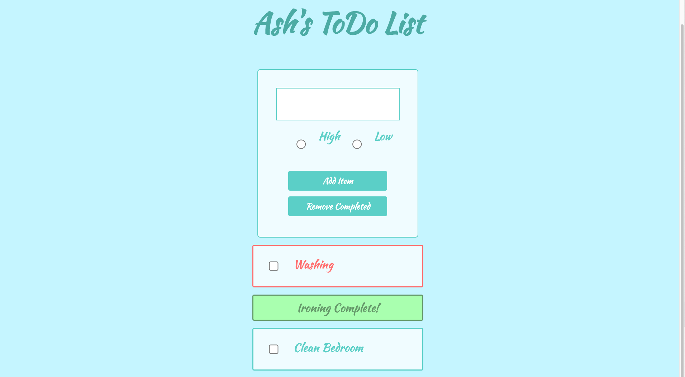

# ToDo-List
A simple single page to do list app created using the Vue JavaScript framework. The task was to create a todo list application that allows the user to save an item to a list which then renders on the page. The app carrys out the following:

* Renders a list of todos
* Adds new todos to the list
* Takes in todo array with keys of name and priority
* Has radio buttons to track the level of priority
* Gives the user visual feedback on what todos are high priority

To run the app open the index.html file in a web browser.

